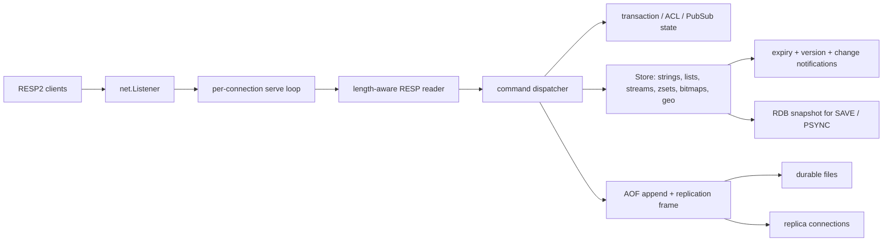

# Pulsekv Go

Pulsekv Go is a dependency-free Redis-compatible server written in Go. It is
the second repository in the Pulsekv portfolio and the Go successor to the
paused C++ experiment. The original `MetalCloth/number_41` repository was a
Chinook RAG demo; its exact history is preserved on
[`archive/number-41-rag`](https://github.com/MetalCloth/pulsekv-go/tree/archive/number-41-rag)
and in the `number-41-rag-archive-2026-09-08` tag before the repository was
renamed.

The implementation follows the CodeCrafters Build Your Own Redis sequence.
The stage checklist, acceptance notes, and known ceilings live in
[`docs/codecrafters-checklist.md`](docs/codecrafters-checklist.md). The two
learning references are cited throughout the design notes:

- [Build Redis from scratch](https://www.build-redis-from-scratch.dev/en/introduction)
- [feliposz/codecrafters-redis-go](https://github.com/feliposz/codecrafters-redis-go)

They are references for protocol and milestone shape, never vendored source.

## What is here

The server currently includes:

| Area | Implementation |
| --- | --- |
| Wire protocol | Length-aware RESP2 reader/writer, pipelining, binary-safe bulk strings, nesting and size limits |
| Core data | Strings, expiry, conditional `SET`, `MGET`/`MSET`, counters, type checks |
| Lists | `LPUSH`, `RPUSH`, `LRANGE`, `LLEN`, `LPOP`, `RPOP`, `BLPOP`, `BRPOP` with timeouts |
| Streams | `XADD`, explicit/partial/automatic IDs, `XRANGE`, `XREAD`, blocking reads, `$`, `-`, `+` |
| Transactions | `MULTI`, `EXEC`, `DISCARD`, `WATCH`, `UNWATCH`, optimistic aborts, queued errors |
| Replication | `INFO`, `PSYNC`, empty RDB transfer, replica handshake, propagation, ACKs, `WAIT` |
| Persistence | RDB string snapshots with expiry and AOF manifest/incremental replay with `always`, `everysec`, `no` |
| Pub/Sub | Channels, patterns, subscribe mode, `PING`, publish, message delivery and unsubscribe |
| Sorted sets | `ZADD`, `ZRANGE`, `ZRANK`, `ZCARD`, `ZSCORE`, `ZREM`, deterministic score/member ordering |
| Bitmaps | `SETBIT`, `GETBIT`, growth, `BITCOUNT`, `BITOP` with unequal source lengths |
| Geospatial | `GEOADD`, coordinate validation, `GEOPOS`, `GEODIST`, radius `GEOSEARCH` |
| Authentication | `ACL WHOAMI`, `ACL GETUSER`, `ACL SETUSER`, nopass/passwords, `AUTH`, enforcement |

The deliberately small runtime uses only the Go standard library. A single
mutex protects the in-memory store, while a per-connection write mutex keeps
asynchronous Pub/Sub and replication frames from interleaving.

## Run it

Requirements: Go 1.21 or newer. The commands below write data below `./data`.

```bash
go run ./cmd/pulsekv \
  -port 6379 \
  -dir ./data \
  -dbfilename dump.rdb \
  -appendonly yes \
  -appendfsync everysec
```

Connect with any RESP2 client, including `redis-cli`:

```text
redis-cli -p 6379 SET greeting "hello from pulsekv"
redis-cli -p 6379 GET greeting
redis-cli -p 6379 XADD events '*' kind created
```

For a disposable container image:

```bash
docker build -t pulsekv-go .
docker run --rm -p 6379:6379 -v "$PWD/data:/data" pulsekv-go
```

The container starts without authentication for local learning. Set an ACL
password before exposing it beyond localhost; see
[`docs/protocol.md`](docs/protocol.md#authentication).

## Development commands

```bash
make fmt       # fail if any Go file needs formatting
make test      # unit and integration tests
make race      # race detector (requires loopback sockets for server tests)
make vet       # static checks
make build     # bin/pulsekv
```

The same checks run in [`.github/workflows/ci.yml`](.github/workflows/ci.yml).
The network integration tests intentionally use real loopback TCP connections;
they catch framing, blocking, Pub/Sub, AOF restart, and replication regressions
that an in-process command test cannot see.

## Architecture



The request path, lock boundaries, persistence format, and replication
handshake are explained with larger diagrams in
[`docs/architecture.md`](docs/architecture.md),
[`docs/persistence.md`](docs/persistence.md), and
[`docs/replication.md`](docs/replication.md).

## Correctness decisions

* RESP bulk payloads are read with `io.ReadFull` using the declared byte
  length. A value containing a newline therefore cannot consume the next
  pipelined command.
* Mutating commands take one server-level serialization lock before changing
  the store, appending AOF, or broadcasting replication frames. The store has
  its own lock so readers and blocking waiters never access maps directly.
* Overwriting a key clears its old expiry. Expiry also removes non-string data,
  advances its watch version, and wakes blockers.
* A blocked list or stream read captures the change channel before checking
  state and rechecks it before sleeping. That closes the lost-wakeup race
  between a failed read and a producer.
* A replica receives `FULLRESYNC`, a generated RDB snapshot, then canonical
  RESP command frames. `WAIT` asks replicas for `GETACK` and counts only offsets
  at or beyond the write being waited on.

Each choice is recorded as an ADR with the rejected alternative and the
failure it prevents. See [`docs/adr`](docs/adr).

## Failure scenarios used in the design

The repository documents incidents as testable scenarios rather than hiding
them in implementation folklore. Examples include a newline in a bulk value,
a stale TTL after overwrite, a producer racing a blocked `BLPOP`, a malformed
ECHO request, an interrupted final AOF frame, and a replica disconnect during
propagation. Reproduction steps and the current response are in
[`docs/failure-scenarios.md`](docs/failure-scenarios.md).

## Portfolio split

| Repository | Role | Status |
| --- | --- | --- |
| [`MetalCloth/pyswitch`](https://github.com/MetalCloth/pyswitch) | Python payment-switch service with Compose deployment, load smoke, and observability | verified local and Render synthetic deployment; production provider credentials intentionally disabled |
| [`MetalCloth/pulsekv-go`](https://github.com/MetalCloth/pulsekv-go) | Go Redis-compatible server built from the CodeCrafters checklist | active implementation; archive branch preserves the former `number_41` app |

The C++ PulseKV repository remains independent and paused. No source is shared
between the Python and Go repositories.

## Resume-ready framing

* Built a binary-safe RESP2 server in Go with concurrent clients, blocking
  data structures, optimistic transactions, persistence, and primary/replica
  replication.
* Added race-detector coverage for storage invariants and real TCP integration
  tests for pipelining, Pub/Sub, blocking reads, AOF recovery, and `WAIT`.
* Documented protocol, concurrency, persistence, replication, incident
  scenarios, and architectural decisions with reproducible commands.
