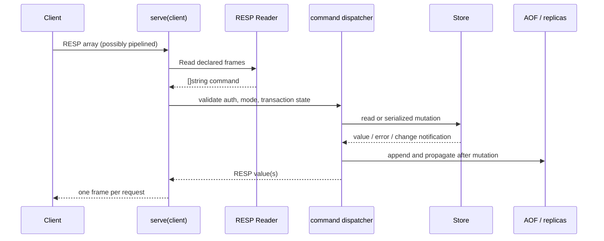
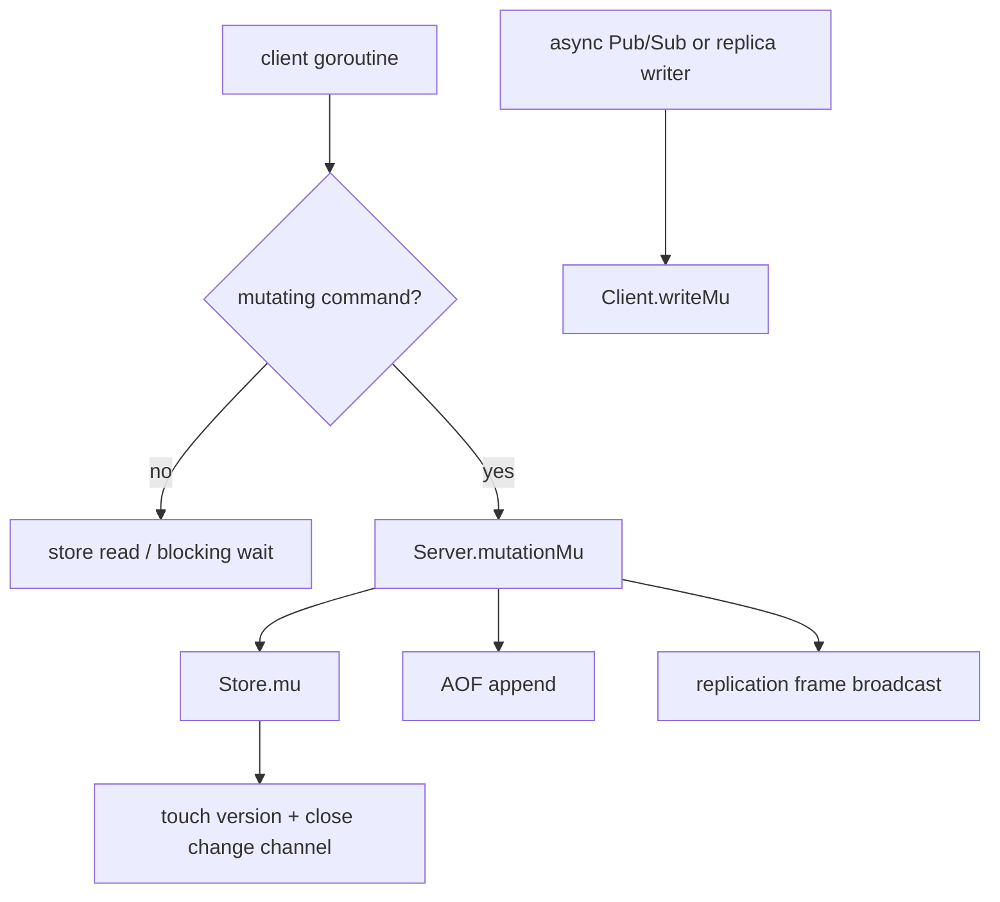
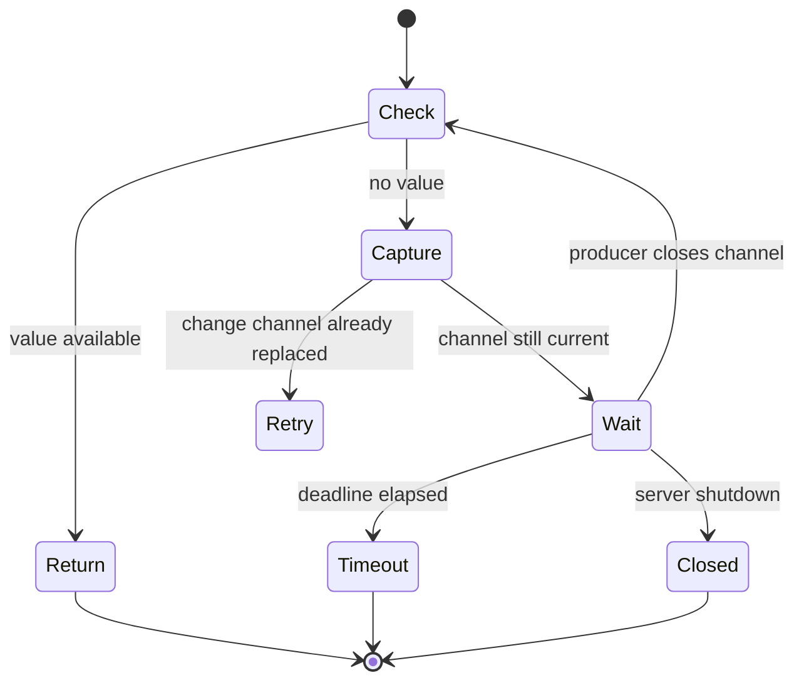

# Architecture

Pulsekv keeps the runtime deliberately flat: a TCP accept loop creates one
client state object and one serving goroutine, the command dispatcher validates
the request, and the store owns every data mutation. There is no ORM, framework,
or background worker pool to hide lock ownership.

## Request lifecycle

`resp.Reader` never calls `ReadString` for a bulk payload. It reads exactly the
declared number of bytes and then consumes exactly one CRLF. This makes the
reader safe for binary values and pipelined commands.

## Lock boundaries

The server lock serializes the state change with its durability and
replication side effects. The store lock protects maps and expiry. The writer
lock is separate so a Pub/Sub message cannot interleave bytes with a normal
reply. A blocked list/stream read does not hold either lock while sleeping.

The global mutation lock is a deliberate first implementation boundary. It is
easy to reason about and gives `EXEC` a clear atomic region. If throughput
becomes a measured problem, the upgrade path is per-key or shard locks with a
stable lock ordering; adding that complexity before a benchmark would make
failure analysis harder.

## State model

Each key belongs to one logical type. The store keeps separate maps for each
type so command code cannot accidentally bypass type checks. `kindLocked` is
the single type lookup used by `GET`, collection commands, `TYPE`, and expiry.

`expires` stores absolute deadlines. Any operation that observes a key first
purges an expired value; purging deletes all possible type maps, advances the
watch version, and wakes waiters. `versions` is independent from data values,
which means `WATCH` detects deletes, expiry, and overwrites consistently.

## Blocking reads

The channel is captured before checking state and compared again before the
goroutine sleeps. That extra comparison closes the classic lost-wakeup window:
a producer that wins between the failed read and the wait causes an immediate
retry instead of leaving the client asleep.
