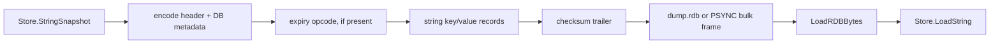

# Persistence

Pulsekv supports the two persistence surfaces needed by the Build Your Own
Redis progression: a small RDB reader/writer for string snapshots and an
append-only command log.

## RDB snapshots

`SAVE` writes `dump.rdb` (or the configured `-dbfilename`) below `-dir`.
`PSYNC` sends the same generated snapshot after `FULLRESYNC`. The reader accepts
Redis headers, auxiliary fields, database selection, resize metadata, seconds
or millisecond expiry, integer-encoded strings, and normal string values. It
ignores the checksum trailer after validating the record stream.



The current snapshot format intentionally covers string values and expiry,
which are the RDB stages in the checklist. Collection snapshots can be added
with additional type opcodes once a compatibility fixture requires them; the
command log already preserves collection mutations.

## AOF

The AOF directory contains a manifest and one incremental RESP file:

```text
appendonlydir/
├── appendonly.aof.manifest
└── appendonly.aof.1.incr.aof
```

Only successful mutating commands reach `AOF.Append`, so reads, failed writes,
transaction queueing, and Pub/Sub are filtered automatically. On startup the
file is replayed through the same command dispatcher with recording disabled.
An incomplete final RESP frame is discarded, which preserves all complete
commands after a process crash during the last write.

`-appendfsync always` syncs each frame, `everysec` syncs in a one-second
background loop and again during close, and `no` delegates timing to the OS.
The replay path runs before the listener accepts clients, so a recovered key
cannot be observed half-applied.

## Durability trade-off

The AOF is the authoritative incremental log for this learning server; RDB is
the compact snapshot surface. There is no rewrite/compaction worker yet. A
production deployment would add an atomic temp-file rewrite, fsync/rename,
manifest rotation, and disk-space alarms after measuring log growth.
