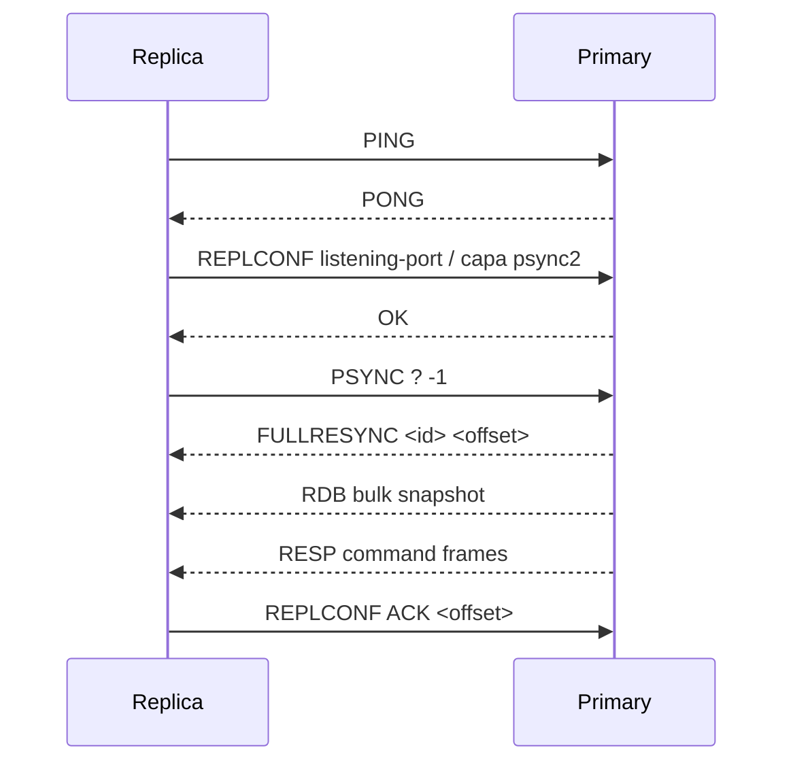

# Replication

Replication uses RESP command frames over a long-lived TCP connection. A server
without `-replicaof` is a primary; a server started with `-replicaof "HOST
PORT"` connects out and applies the primary's stream.

## Handshake and full sync

The primary records a random replication ID and byte offset. Every successful
mutation is encoded once, appended to AOF (when enabled), and broadcast to all
registered replicas. A failed write removes that replica from the broadcast
set and closes its connection so a later reconnect performs a clean sync.

`PSYNC` currently chooses the safe `FULLRESYNC` path. The snapshot contains all
string values and expiries; subsequent command frames cover strings and every
collection mutation. Partial backlog replay (`CONTINUE`) is a natural next
step once a bounded replication backlog is needed.

## ACK and WAIT

`WAIT <replicas> <milliseconds>` captures the primary offset for the writes
that preceded it, asks connected replicas for `GETACK`, and counts ACKs at or
beyond that offset. It returns early when the requested number is reached, or
the number of connected replicas is exhausted, and otherwise returns the count
at timeout. ACK updates wake waiters without polling sleeps.

## Failure handling

The replica loop retries a failed dial or stream after 500 ms until shutdown.
Its replay path disables AOF and re-propagation, preventing an echo loop. The
replica's own listener remains available while the upstream connection retries,
so clients can inspect `INFO replication` and current state.

The current design has no authentication or TLS on the replication link. Keep
it on a private network for local learning; a production version would add
ACL/TLS configuration before exposing the port.
